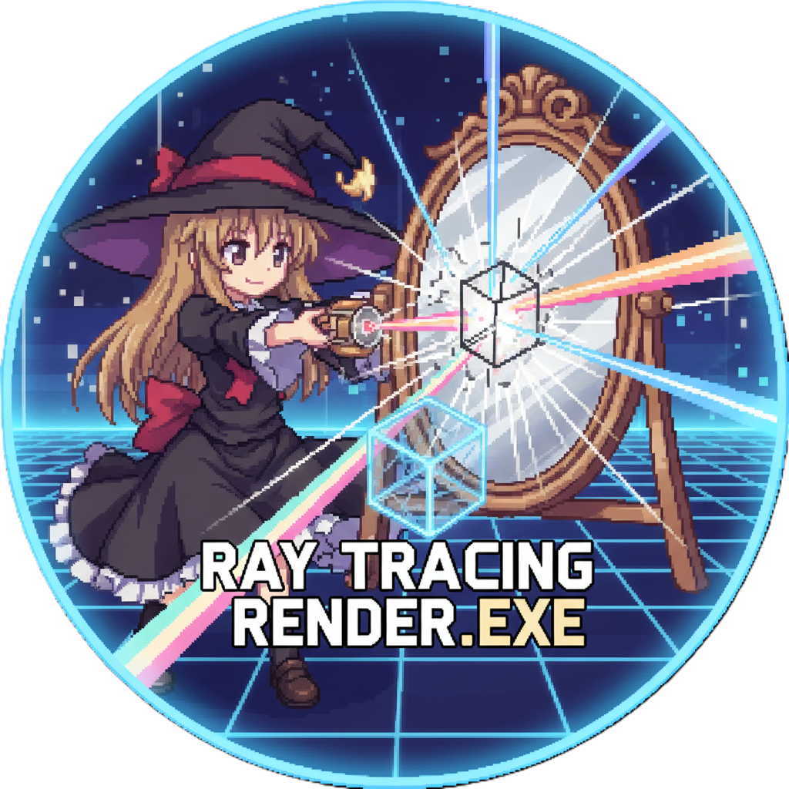
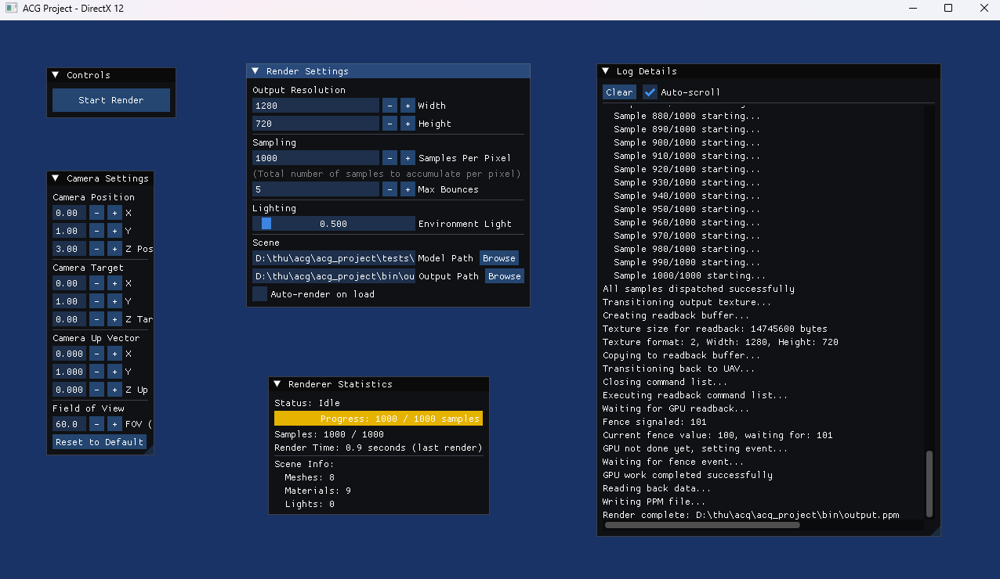
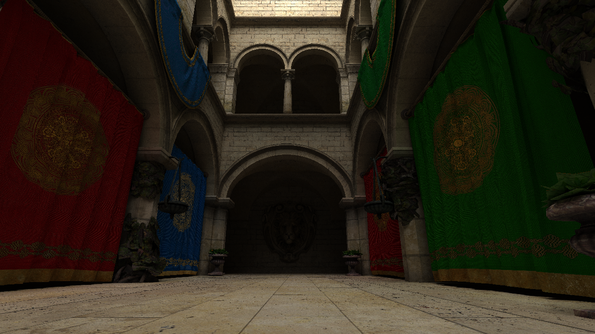
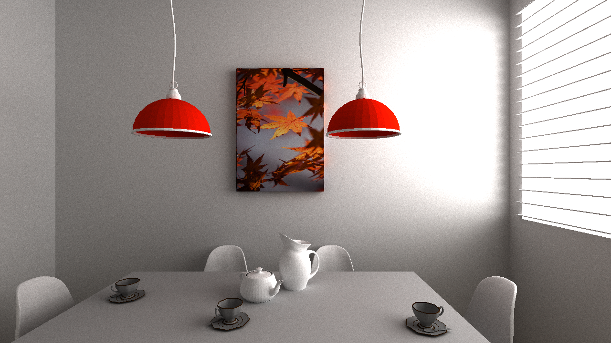
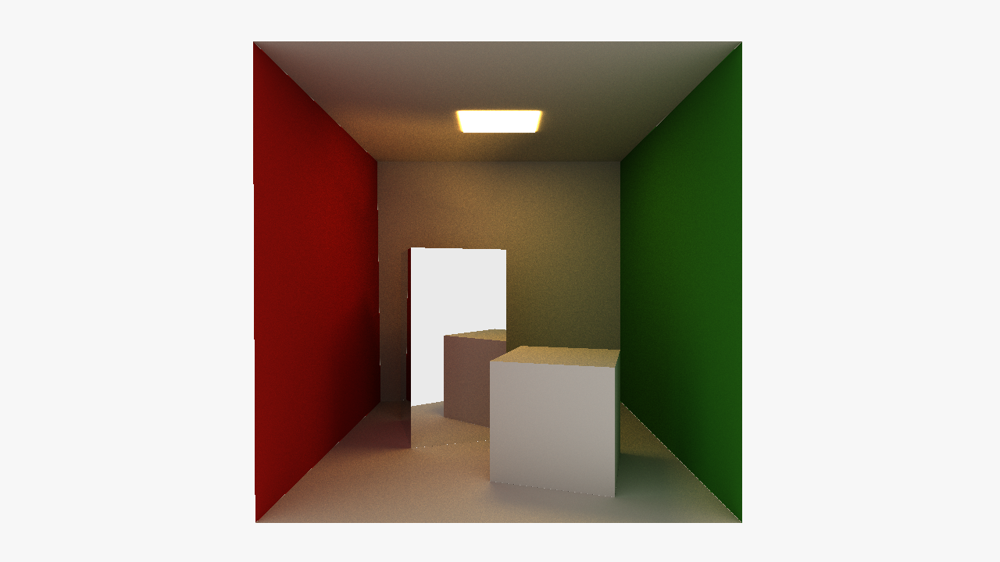
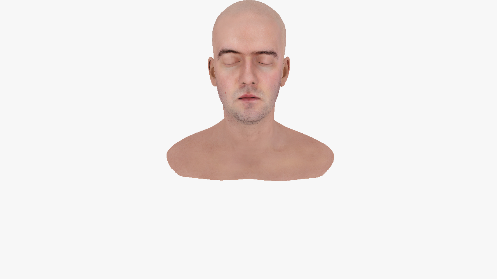

# ACG Project
<div align="center">

</div>

<div align="center">


</div>

This repository contains the code and resources for the Advanced Computer Graphics (ACG) project for the Fall 2025 semester. The project focuses on ray tracing techniques and rendering algorithms.

## Targets and Course Requirements

We are planning to implement a GPU-based renderer that meets the following course requirements:
<details>
<summary>Click to expand the requirements</summary>

- Base: Implement a path tracing algorithm that correctly handles diffuse and specular materials. (basic) :white_check_mark:
- Scene creation: Build a custom scene with aesthetic considerations, using geometry that you create from scratch or find online (ensure the source is credited). (basic, tidiness and attractiveness 1pt) :construction:
- Acceleration structure: Implement an acceleration structure such as BVH (Bounding Volume Hierarchy). This is not required for hardware-based renderers, as the acceleration structure is built-in in that case. (basic, Surface Area Heuristic or another advanced algorithm 2pts) :construction:
- Material: Create a (non-trivial) custom material. Options include:
    - Transmissive material (basic) :white_check_mark:
    - Principled BSDF (2pts) :x:
    - Multi-layer material (2pts) :x:
    - Rendering of fur, hair, skin, etc. (2pts) :x:
- Texture: Create your own (non-trivial) texture with proper texture mapping. Options include:
    - Color texture (basic) :white_check_mark:
    - Normal map, height map, attribute map, or any functional texture mapping (1pt for each, up to 2pts) :construction:
    - Implement an adaptive mipmap algorithm (2pts) :x:
- Importance Sampling: Use more advanced sampling algorithms for path tracing. (Importance sampling with Russian Roulette, multiple importance sampling 2pts) :construction:
- Volumetric Rendering: Options include:
    - Subsurface scattering (2pts) :x:
    - Homogeneous volume rendering (1pt) :x:
    - Inhomogeneous volume rendering (1pt) :x:
    - Channel-independent subsurface scattering (1pt) :x:
    - Volumetric emission (1pt) :x:
    - Volumetric alpha shadow (2pts) :x:
- Special Visual Effects: Options include:
    - Motion blur, depth of field (basic) :x:
    - Alpha shadow (basic) :x:
    - Cartoon style rendering (2pts) :x:
    - Chromatic dispersion (2pts) :x:
- Lighting: Options include:
    - Point light and area light (basic) :construction:
    - Environment lighting with HDR, such as skybox (2pts) :white_check_mark:
- Anti-aliasing: Implement an anti-aliasing algorithm (basic) :white_check_mark:
- Simulation-based content creation: Up to 2pts :construction:
</details>

Details of each requirement can be found in the [project description document](/docs/ACG_2025_Project_Announcement.pdf).

## Repository Structure
```
acg_project/
├── include/             # Header directory
│   ├── Camera.h         # Camera system
│   ├── Denoiser.h       # Denoising using OIDN
│   ├── DX12Helper.h     # DirectX 12 helper functions
│   ├── GUI.h            # GUI system using ImGui
│   ├── Light.h          # Lighting system (point light, area light, environment light)
│   ├── LogRedirector.h  # Redirect console output to GUI log panel
│   ├── Material.h       # Material system (diffuse, specular, transmissive, PBR)
│   ├── MathUtils.h      # Math utility functions
│   ├── Mesh.h           # Geometry mesh
│   ├── MTLParser.h      # MTL file parser
│   ├── Renderer.h       # GPU renderer (DirectX 12)
│   ├── Resource.h       # Resource definitions (icons, etc.)
│   ├── Sampler.h        # Sampler (importance sampling, MIS)
│   ├── Scene.h          # Scene management
│   ├── Texture.h        # Texture system (supports Mipmap)
│   └── VirtualTextureSystem.h # Virtual Texture System
│
├── src/                 # Source files directory
│   ├── Camera.cpp
│   ├── Denoiser.cpp
│   ├── GUI.cpp
│   ├── Light.cpp
│   ├── Material.cpp
│   ├── MathUtils.cpp
│   ├── Mesh.cpp
│   ├── MTLParser.cpp
│   ├── Renderer.cpp
│   ├── Sampler.cpp
│   ├── Scene.cpp
│   ├── Texture.cpp
│   ├── VirtualTextureSystem.cpp
│   └── main.cpp         # Main program entry point
│
├── shaders/             # Shader files directory
│   ├── Raytracing.hlsl  # HLSL shader for ray tracing
│   ├── Random.hlsli     # HLSL shader for random number generation
│   └── Structures.hlsli # HLSL shader structures
│
├── lib/                 # Third-party libraries
│   ├── oidn/            # Open Image Denoise library
│   └── WinPixEventRuntime/ # PIX for Windows library
│
├── docs/                # Documentation directory
├── tests/               # Test scenes and scripts
├── ACG_Project.rc       # Resource script for application icon
├── CMakeLists.txt       # CMake build configuration
├── vcpkg.json           # vcpkg dependency configuration
├── requirements.txt     # Python dependencies for test scripts
├── logo.ico             # Application icon file
├── LICENSE              # License file
└── README.md            # Project description
```

## Usage

> [!NOTE]
>
> We only support DX12 on Windows, and the hardware supports DirectX Raytracing (DXR).

We provide a GUI for users to configure rendering settings and load scenes. The GUI allows you to adjust parameters such as samples per pixel, maximum bounces, and load different 3D models.

<div align="center">
    
</div>

- **Render Settings:** Adjust output resolution, sampling parameters, lighting intensity, and scene model paths.
- **Camera Settings:** Configure camera position, target, up vector, and field of view.
- **Render Statistics:** Monitor rendering progress, samples, and performance metrics.
- **Controls:** Start or stop rendering processes.
- **Log Details:** View log messages and debug information.

<details>
<summary>Demo</summary>
<div align="center">
    
</div>
<div align="center">
    
</div>
<div align="center">
    
</div>
<div align="center">
    
</div>
</details>

## Development
### Dependencies

This project requires the following dependencies:
- CMake >= 3.15
- A C++17 compatible compiler
- vcpkg for managing third-party libraries
- Windows SDK for DirectX libraries
- [OIDN](https://www.openimagedenoise.org/index.html) (We have offered a pre-compiled binary in the `lib` folder)

For debugging and performance analysis, we use [PIX for Windows](https://devblogs.microsoft.com/pix/).

[MTL format](https://paulbourke.net/dataformats/mtl/) and [OBJ format](https://paulbourke.net/dataformats/obj/obj_spec.pdf) are used for material and model files, respectively.

### Building the Project

To build the project, follow these steps:
1. Clone the repository:
    ```bash
    git clone https://github.com/gameswu/acg_project.git
    cd acg_project
    ```
2. Configure and build the project using CMake:
    ```bash
    cmake -B build -S . -DCMAKE_TOOLCHAIN_FILE="$env:VCPKG_ROOT/scripts/buildsystems/vcpkg.cmake"
    cmake --build build --config Release
    ```

### Running tests

We offer several test scenes located in the `tests` directory. You can load these scenes through the GUI by specifying the model path in the Render Settings section. Using the python script to unzip all test scenes:

```bash
python -m venv .venv
.venv\Scripts\activate # On Windows
pip install -r requirements.txt
cd tests
python download.py
python unzip.py
```

Simple test scenes made by us.

| Test Scene | Targeted Feature |
| materialtest | Material rendering |

Models downloaded from Morgan McGuire's [Computer Graphics Archive](https://casual-effects.com/data).

| Test Scene | Targeted Feature |
|------------|------------------|
| CornellBox | Basic rendering test |
| breakfast_room | Texture mapping |
| sponza | Large scene |
| lpshead | Head model |
| fireplace_room | Complex scene |
| gallery | Gallery scene |
| bedroom | Bedroom scene |
| San_Miguel | Architectural scene |
| bistro | Final scene |

Models downloaded from [Sketchfab](https://sketchfab.com/).

| Test Scene | Targeted Feature |
|------------|------------------|
| cloud | Volumetric rendering |
| hair_cards_fbx | Hair rendering |
| project_-_cirno_fumo_3d_scan | FUMO |

The skybox downloaded from [HDRI Haven](https://hdrihaven.com/).

## License

[MIT License](LICENSE)